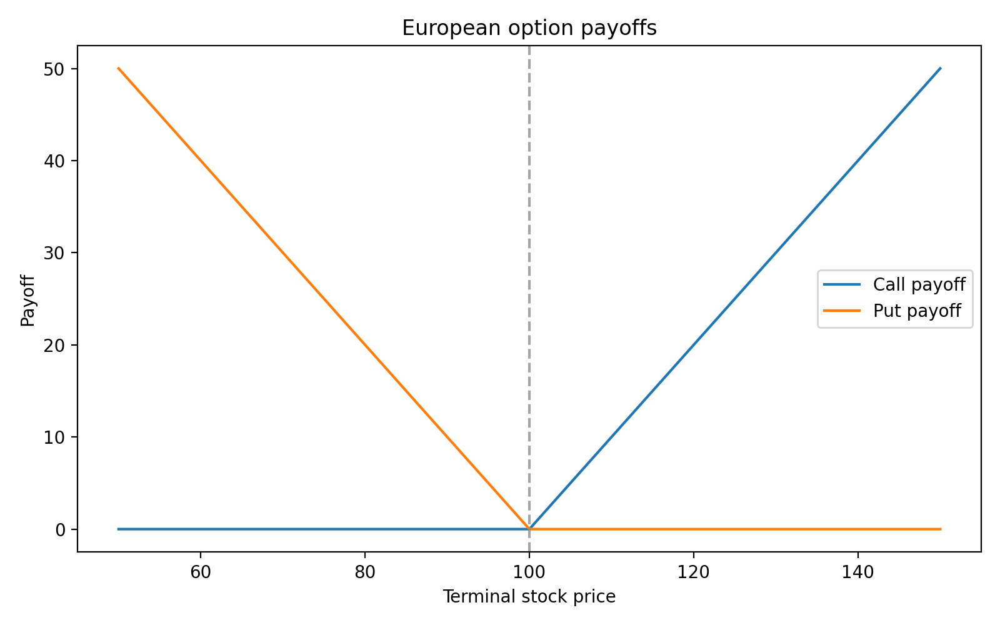
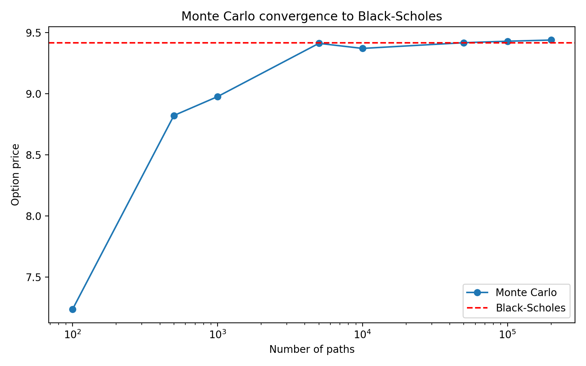
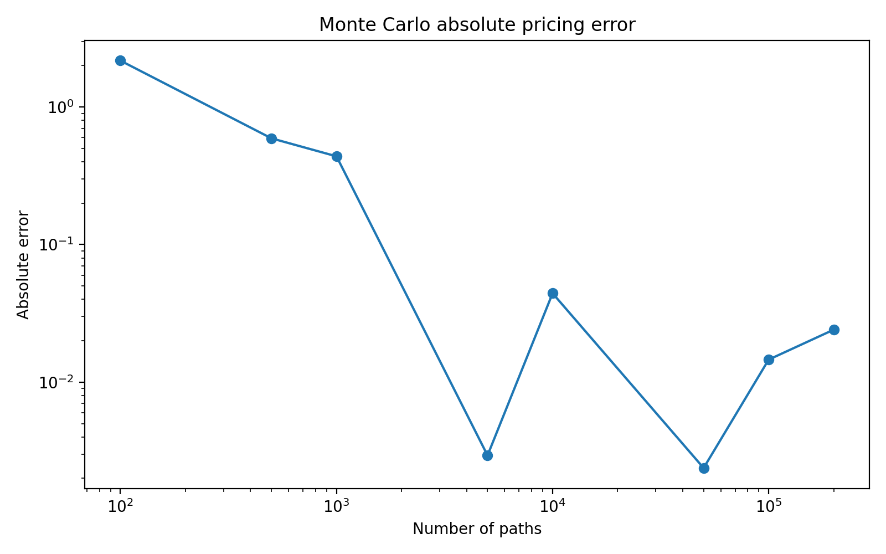
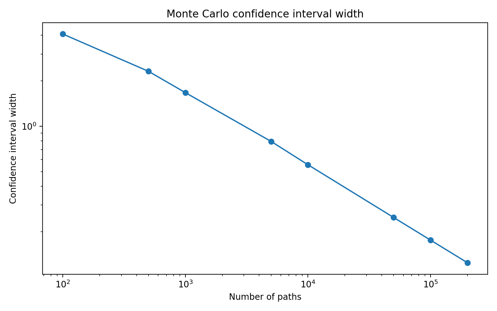
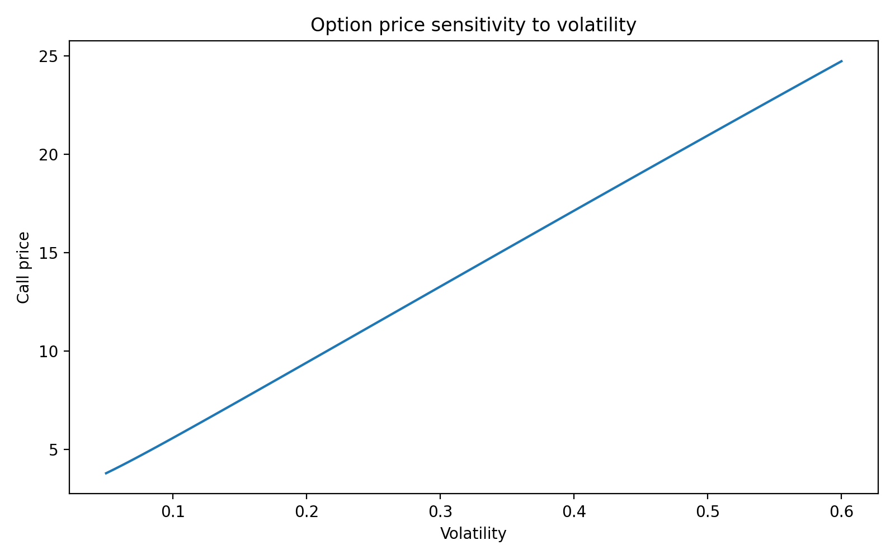
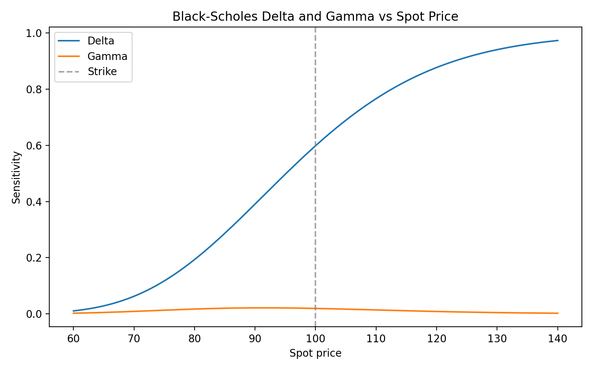
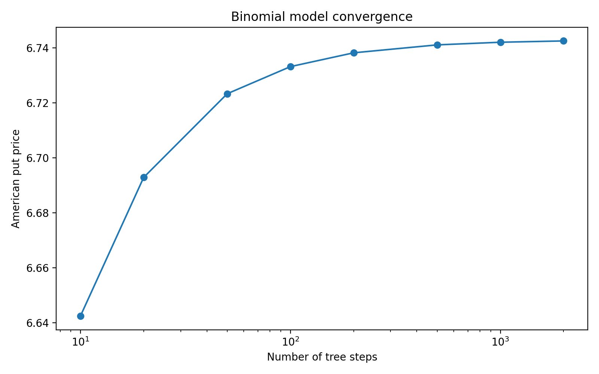

# Monte Carlo Option Pricer

A Python-based option pricing engine for European and American-style options.

The project implements:
- analytical Black-Scholes pricing for European options
- Monte Carlo pricing with confidence intervals and antithetic variates
- implied volatility estimation via Newton's method
- American option pricing via a Cox-Ross-Rubinstein binomial tree

The purpose of the project is to demonstrate practical derivative pricing, numerical validation, and experiment design relevant for quantitative finance.

## Features

- Black-Scholes pricing for European calls and puts
- Greeks: Delta, Vega, Gamma
- Monte Carlo pricing under risk-neutral GBM
- Confidence intervals for Monte Carlo estimates
- Antithetic variates for variance reduction
- Implied volatility solver
- American option pricing with a binomial model

## Installation

```bash
git clone <repo-url>
cd monte-carlo-option-pricer
pip install -e .
```

## Models

### Black-Scholes
European options are priced analytically under the Black-Scholes assumptions:
- geometric Brownian motion
- constant volatility
- no arbitrage

### Monte Carlo
European option prices are estimated by simulating terminal stock prices under the risk-neutral measure and discounting the expected payoff.

### Implied Volatility
Implied volatility is computed by solving for the volatility that reproduces a given market price under Black-Scholes using Newton's method.

### Binomial Model
American options are priced using a Cox-Ross-Rubinstein binomial tree with backward induction and early exercise at each node.

## Numerical Experiments

### 1. Payoff profiles


### 2. Monte Carlo convergence
Monte Carlo prices converge toward the Black-Scholes benchmark as the number of simulated paths increases.


### 3. Absolute pricing error
The absolute pricing error decreases as the number of Monte Carlo paths increases until a certain point in which it spikes again.


### 4. Confidence interval width
Confidence intervals shrink as the number of simulated paths increases.


### 5. Volatility sensitivity
Option prices increase with volatility, as expected.


### 6. Greeks
Delta and Gamma exhibit the expected behaviour under the Black-Scholes model. 
Delta transitions smoothly from 0 to 1, while Gamma peaks around the strike price.


### Binomial pricing model convergence
The American put price converges as the number of tree steps increases, indicating numerical stability of the binomial model.



## Validation

The project includes tests for:
- put-call parity
- implied volatility recovery
- Monte Carlo consistency with Black-Scholes
- American put vs European put
- convergence properties of the binomial model

## Future Improvements

- Barrier and Asian options
- control variates
- C++ implementation for large-scale simulation
- UI to enable easy use